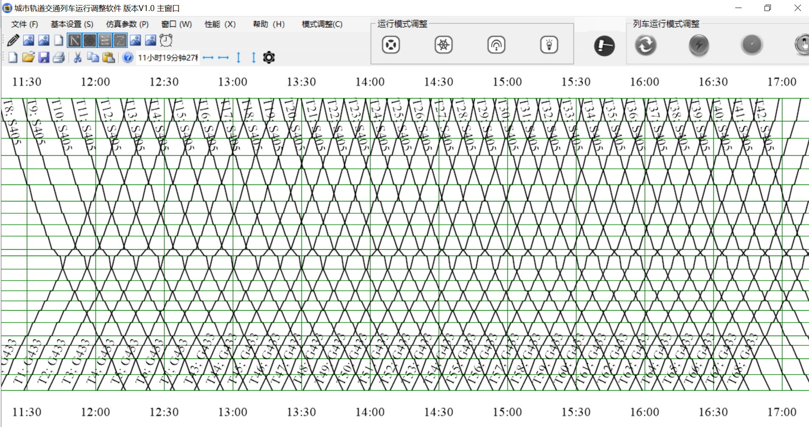

# Real-Time Rolling Stock and Timetable Rescheduling in Urban Rail Transit Systems

This fold gives the details infomration of the constructed 30 instances for testing and verification of the algorithms in our paper.

This fold involves four sub-folders, Small_instances presents the 10 small-scale instances, Medium_instances presents the 10 medium-scale instances, Large_instances presents the 10 large-scale instances, and Layout_information gives the detailed information of section running time, station information etc.

In each file in the instances, we give a planned timetable of trains in this instance. In particular, the following information are involved:

* Rolling stock index (列车号)
* Service number (服务号)
* Station index (车站)
* Arrival time at the corresponding station (unit: s) (到达)
* Departure time at the corresponding station (unit: s) (出发)
* Name of the station (车站名称)
* Train index (列车编号)

In other words, each row in the instance file represetns two events (an arrival and a departure event). Note that, you can visualize the timetable in each instance by using our RSTO software in the project. If you want to visualize the timetable in each instance, you can compile the whole project and run the exe file. Then you can take actions in the UI. Click right mouse in the UI, and click "Input timetable" button. Then, choose one instance file in the folder. You will see the timetable being displayed in the UI (illustrated as follows)! 

## Some Other Parameters in the experiments

There are a total of 23 stations in Beijing metro line 1. Among these stations, there are six stations and two depots that allow trains to turn their directions. The names of these stations are BJ, YQL, GZF, XD, WFJ and GM. The names of the tweo depots are GY deopt and WS depot.

The basic operational parameters, involving running time between two stations, dwelling time at the platforms, minimum turnaround time, safety headway time  and slack time, etc.

* Number of stations $|I|$: 23
* Number of depots $|D|$: 2, located at GY station and WS station
* Minimum headway $\bar{h}$: 60 (unit: s)
* Turnaround time $T_{turn}$: 150 (unit: s)
* Slack travel time $\epsilon_e$: 10 (unit: s)
* Planned travel time of each section (peak-hour period): 200, 150, 150, 120, 140, 150, 110, 100, 100, 120, 60, 120, 110, 90, 90, 90, 110, 120, 90, 120, 140, 120 (unit: s)
  |Section|GY-GC|GC-BJ|BJ-BBS|BBS-YQL|YQL-WKS|WKS-WSK|WSL-GZF|GZF-JB|JB-MXD|MXD-NLSL|NLSL-FXM|FXM-XD|XD-TMX|TMX-TMD|TMD-WFJ| WFJ-DD| DD-JGM| JGM - YAL| YAL-GM| GM-DWL| DWL-SH| SH-SHD|
  |----|----|----|----|----|----|----|----|----|----|----|----|----|----|----|----|----|----|----|----|----|----|----|
  |Up-direction|200|150|150|120|140|150|110|100|100|120|80|120|110|90|90|90|110|120|90|120|140|120|
  |Down-direction|200|150|150|120|140|150|110|100|100|120|60|120|110|90|90|90|110|120|90|120|140|120|
* Planned dwelling time of each station (peak-hour period): 20, 30, 30, 25, 35, 40, 35, 45, 50, 30, 27, 50, 44, 26, 28, 30, 45, 45, 30, 45, 45, 30, 20 (unit: s)
|Station|GY|GC|BJ|BBS|YQL|WKS|WSL|GZF|JB|MXD|NLSL|FXM|XD|TMX|TMD| WFJ| DD| JGM| YAL| GM| DWL| SH| SHD|
  |----|----|----|----|----|----|----|----|----|----|----|----|----|----|----|----|----|----|----|----|----|----|----|----|
  |Up-direction|20| 30| 30| 25| 35| 40| 35| 45| 50| 30| 27| 50| 44| 26| 28| 30| 45| 45| 30| 45| 45| 30| 20|
  |Down-direction|20| 30| 30| 25| 35| 40| 35| 45| 50| 30| 27| 50| 44| 26| 28| 30| 45| 45| 30| 45| 45| 30| 20|

* Planned travel time of each section (off-peak-hour period): 210, 160, 150, 120, 150, 150, 120, 100, 100, 120, 70, 120, 110, 90, 90, 100, 110, 120, 90, 120, 140, 130 (unit: s)
  |Section|GY-GC|GC-BJ|BJ-BBS|BBS-YQL|YQL-WKS|WKS-WSK|WSL-GZF|GZF-JB|JB-MXD|MXD-NLSL|NLSL-FXM|FXM-XD|XD-TMX|TMX-TMD|TMD-WFJ| WFJ-DD| DD-JGM| JGM - YAL| YAL-GM| GM-DWL| DWL-SH| SH-SHD|
  |----|----|----|----|----|----|----|----|----|----|----|----|----|----|----|----|----|----|----|----|----|----|----|
  |Up-direction|210|160|150|120|150| 150| 120| 100| 100| 120| 80| 120| 110| 90| 90| 100| 110| 120| 90| 120| 140|130|
  |Down-direction|210|160|150|120|150| 150| 120| 100| 100| 120| 70| 120| 110| 90| 90| 100| 110| 120| 90| 120| 140|130|
  
* Planned dwelling time of each station (off-peak-hour period): 20, 30, 30, 25, 35, 35, 30, 35, 40, 30, 27, 40, 44, 26, 28, 30, 45, 30, 30, 30, 30, 30, 20 (unit: s)
|Station|GY|GC|BJ|BBS|YQL|WKS|WSL|GZF|JB|MXD|NLSL|FXM|XD|TMX|TMD| WFJ| DD| JGM| YAL| GM| DWL| SH| SHD|
  |----|----|----|----|----|----|----|----|----|----|----|----|----|----|----|----|----|----|----|----|----|----|----|----|
  |Up-direction|20| 30 | 30 | 25| 35| 35| 30| 35| 40| 30| 27| 40| 44| 26| 28| 30| 45| 30| 30| 30| 30| 30| 20|
  |Down-direction|20| 30 | 30 | 25| 35| 35| 30| 35| 40| 30| 27| 40| 44| 26| 28| 30| 45| 30| 30| 30| 30| 30| 20|
